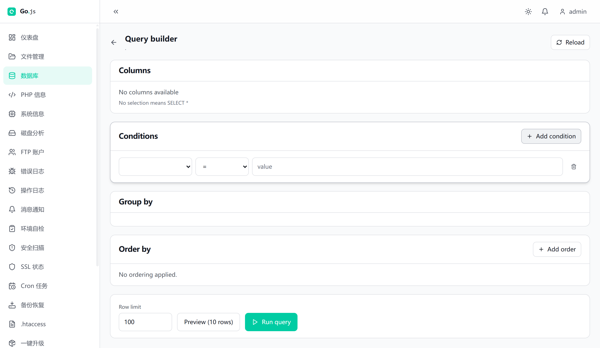

# Database Query Builder

## Overview

The query builder is a visual, read-only SQL construction tool in the Go.js-Lite
control panel. It lets an operator assemble a `SELECT` against a MySQL table by
picking columns, adding filter conditions, grouping, ordering and setting a row
limit, without writing SQL by hand. The corresponding raw-SQL console is
documented separately under `### Database` (`db/sql`) in `api.md`.

The endpoint and UI names are misleading, so read this first:

- `db/query/builder` builds a `SELECT` from your clauses AND executes it, honouring
  `limit` and `offset`.
- `db/query/preview` builds the same statement, ignores `limit`/`offset`, forces
  `LIMIT 10`, AND ALSO executes it. It returns the generated `sql` together with the
  first ten rows.

`preview` is NOT a dry run. There is no endpoint in Go.js-Lite that plans a
statement without running it. Do not treat `preview` as a safe no-execution mode:
it issues a real `SELECT ... LIMIT 10` against the database. What it actually is,
is a bounded preview - you see the exact SQL the builder produced and the first ten
rows it returns. That is useful for checking a clause before a larger `Run query`.

Reference: the full parameter tables for `db/query/builder`, `db/query/preview`,
`db/sql` and `db/connections` live in `api.md` under `### Database`,
`### Database Tables` and `### Database Query Builder`. This guide explains how to
use them, not the wire format.

## The build-then-run workflow

Open the Database area, pick a MySQL connection, and browse to a table. The Query
builder page (`/db/:connId/query/builder`) presents five cards:

- Columns: tick the columns to return. No selection means `SELECT *`.
- Conditions: rows of field / operator / value.
- Group by: tick columns to group on.
- Order by: rows of field plus `ASC` / `DESC`.
- A Row limit input plus two actions: Preview (10 rows) and Run query.

Both actions send the same clauses to the backend. `Preview (10 rows)` calls
`db/query/preview`; `Run query` calls `db/query/builder`. After the call the page
shows a Generated SQL panel and a Result grid. The only difference between the two
buttons is the row bound (10 versus your limit) and whether `limit`/`offset` are
used.

## Clause model

A query is described by these clauses:

| Clause    | Field      | Notes |
|-----------|------------|-------|
| Columns   | `columns`  | Array of column names, or empty for `*`. |
| Conditions| `conditions` | Array of `{ field, operator, value }`. |
| Group by  | `groupBy`  | Array of column names. |
| Order by  | `orderBy`  | Array of `{ field, direction }`, direction `ASC` or `DESC`. |
| Limit     | `limit`    | Integer, default 100. Ignored by preview. |
| Offset    | `offset`   | Integer, default 0. Ignored by preview. |

### Supported operators

Conditions accept exactly these operators, validated server side by
`gojs_db_allowed_query_operators`:

`eq`, `ne`, `gt`, `gte`, `lt`, `lte`, `like`, `in`, `null`, `notnull`

- `eq`, `ne`, `gt`, `gte`, `lt`, `lte` compare a value with `=`, `!=`, `>`, `>=`, `<`, `<=`.
- `like` builds `LIKE`. The value is taken verbatim, so supply your own wildcards
  (for example `admin%`).
- `in` expects an array of values and builds `IN (...)`. In the UI a comma-separated
  value is split into the array.
- `null` and `notnull` take no value and build `IS NULL` / `IS NOT NULL`.

Any other operator returns `invalid_condition_operator` (400).

## How values are escaped

Values are NOT bound to prepared statements. The `gojs_db_build_where_clause`
helper interpolates each value into the SQL string after escaping it through
`gojs_db_escape_value`:

- Strings are escaped with `mysqli::real_escape_string` (mysqli) or `PDO::quote`
  (PDO), then wrapped in single quotes.
- Integers and floats are emitted as their unquoted numeric text.
- `null` is emitted as the SQL `NULL` keyword.
- `in` escapes every element of the array the same way and joins them.

Column names, the table name, group-by fields and order-by fields are not escaped
as values. They are validated against `^[A-Za-z0-9_$]{1,64}$` and then wrapped in
backticks; the table name additionally doubles any embedded backtick. Invalid
identifiers are rejected with `invalid_column_name`, `invalid_group_field`,
`invalid_order_field` or `invalid_condition_field` (400).

What this means for safety: escaping defends against SQL injection for the values
and operators the builder supports, and identifiers are constrained to a safe
pattern. It is escaping, not parameter binding, so the resulting SQL string is
still a fully formed statement that is sent to the server and executed.

## Query builder vs raw SQL

Use the query builder for ad-hoc, read-only `SELECT`s against a single table when
you want the clause UI and the generated SQL. It can only ever emit a `SELECT`.

Use `db/sql` (the SQL Console, `### Database` in `api.md`) when you need anything
the builder cannot express: joins, subqueries, aggregates, `SHOW` / `DESCRIBE`, or
write statements such as `INSERT` / `UPDATE` / `DELETE` / `CREATE`. `db/sql`
executes whatever statement string you pass, including writes, so it is more
powerful and less constrained than the builder.

## Limits and safety rails

- Row limit: the builder defaults to `limit = 100`. `limit` and `offset` are cast
  to integers on the server, so they cannot inject extra SQL - `LIMIT` injection is
  not possible through these fields.
- Preview bound: `db/query/preview` ignores `limit`/`offset` and always appends
  `LIMIT 10`.
- No writes: the builder always generates `SELECT ... FROM <table>`. There is no
  path to issue an `INSERT` / `UPDATE` / `DELETE` (or any write) from the builder;
  use `db/sql` or the table endpoints (`### Database Tables`) for writes.
- Connection model: connections are stored server side via `db/connections`
  (`### Database`). The builder and `db/sql` select one by `connId`. If no
  `connId`, `database` or `table` is supplied, the call fails with `db_not_connected`
  (`db.notConnected` = "No database connection selected or connection not found.").
- Missing MySQL extension: if neither `mysqli` nor `PDO_MySQL` is loaded, every
  database endpoint returns code `mysql_not_available` with message key
  `db.mysqlNotAvailable` ("MySQL extension is not available (missing mysqli or
  PDO_MySQL)."). Database management is effectively disabled until the extension is
  installed.

## Worked example

Goal: list recent paid orders over 50, newest first, capped at 20 rows.

On the Query builder page for table `orders`:

- Columns: tick `id`, `customer_id`, `total`, `status`.
- Conditions: add `status` `eq` `shipped`; add `total` `gte` `50`.
- Order by: `total` `DESC`.
- Row limit: `20`.
- Click Run query.

The builder sends those clauses to `db/query/builder` and produces:

```sql
SELECT `id`, `customer_id`, `total`, `status`
FROM `orders`
WHERE `status` = 'shipped' AND `total` >= 50
ORDER BY `total` DESC
LIMIT 20
```

Clicking Preview (10 rows) instead would send the same clauses to
`db/query/preview` and return the same SQL with `LIMIT 10` and the first ten rows.

## Troubleshooting

| Symptom | Likely cause | Check |
|---------|--------------|-------|
| `mysql_not_available` on every call | PHP lacks `mysqli` and `PDO_MySQL` | Confirm the MySQL extension is enabled on the host. |
| `db_not_connected` | No `connId`, `database` or `table` | Verify a connection is selected and the table name is set. |
| `db_connect_failed` | Wrong host/port/credentials | Re-check the connection in `db/connections`. |
| `invalid_condition_operator` | Operator not in the allowed list | Use one of `eq`, `ne`, `gt`, `gte`, `lt`, `lte`, `like`, `in`, `null`, `notnull`. |
| `invalid_column_name` / `invalid_group_field` / `invalid_order_field` | Identifier has bad characters or is too long | Names must match `A-Za-z0-9_$` and be at most 64 chars. |
| Preview returns different rows than Run | Preview forces `LIMIT 10` and ignores `limit`/`offset` | Expected; use Run query for the full bound. |
| `in` condition seems ignored | Value list was empty after split | Provide at least one comma-separated value. |

## Screenshots

Captured from a local installation of this revision, on a host with no MySQL
server reachable, so the column list is empty and no query was run. That makes
the capture useful for the layout and the controls, but it cannot show the
operators, the generated SQL or a result grid.

### The builder, one condition added



Read this against the endpoint reference above:

- **Columns** — `No columns available`, because the builder could not reach the
  connection to read the schema, with the reminder `No selection means SELECT *`.
  On a working connection this is a list of checkboxes. Note that leaving it
  empty is what produces `SELECT *`, and an unchecked box behaves the same as a
  missing one.
- **Conditions** — one row, added by **Add condition**: a column selector, an
  operator selector, a value input and a delete button. The operator list is the
  ten values in the table above (`eq`, `ne`, `gt`, `gte`, `lt`, `lte`, `like`,
  `in`, `null`, `notnull`), rendered as `=`, `!=`, `>`, `>=`, `<`, `<=`, `LIKE`,
  `IN`, `IS NULL`, `IS NOT NULL`. The column selector is empty here because the
  schema could not be read.
- **Group by** and **Order by** — `Add order` adds ordering rows; both feed
  `group_by` / `order_by` in the request body.
- **Row limit** — `100`, which becomes the `limit` sent to `db/query/execute`.
- **Preview (10 rows)** and **Run query** — the two paths to the same endpoint
  described under [the Overview](#overview). Preview
  overrides the row limit with `LIMIT 10`.

> **The builder is not localized.** Every label on this page is English even
> when the panel is set to another language, while the surrounding navigation
> and the rest of the panel are translated. The strings are hard-coded rather
> than read through the i18n layer.

### Screens not captured here

These need a reachable MySQL server:

- **The builder with a real schema** — Columns with boxes ticked, a condition row
  reading `status` / `eq` / `shipped`, Order by set to `total` / `DESC`, and the
  operator dropdown open to show all ten options.
- **After Run query** — the Generated SQL panel with the produced `SELECT`, and
  the result grid beneath it.
- **After Preview (10 rows)** — the same SQL with `LIMIT 10` forced on, to
  illustrate the difference the warning above is about.
