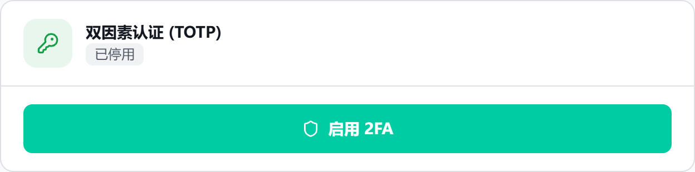
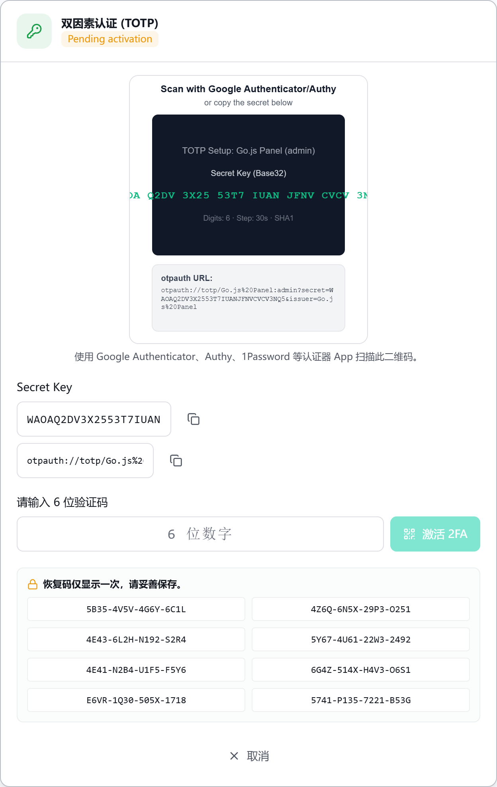

# Two-Factor Authentication (2FA)

## Overview

Go.js-Lite protects sign-in with per-user TOTP (Time-based One-Time Password)
two-factor authentication. When 2FA is enabled for an account, that user must
enter a 6-digit authenticator code - or a one-time recovery code - after their
password on every login.

This guide is written for panel operators. The endpoint reference for the
`auth/totp/*` actions lives in [api.md](api.md); this document explains the
behaviour and the operator-facing workflow rather than repeating the endpoint
tables.

## Where 2FA lives

2FA is stored per user. Each enabled account carries a TOTP record in
`.gojs/users.json` containing the encrypted secret, the encrypted recovery
codes, the set of already-used recovery codes, and the code format.

Before 0.8.0, TOTP was a single global enrolment kept in `config.php`. The
0.8.0 upgrade migrates any legacy global enrolment into the seeded admin user's
per-user record on first access; `config.php` is no longer the source of truth
for TOTP. See [migration-0.7-to-0.8.md](migration-0.7-to-0.8.md). When the
per-user storage helper is unavailable, the backend falls back to the legacy
`config.php` record.

Storage summary:

| Item | Location | Encrypted |
| --- | --- | --- |
| TOTP secret | `users.json` per-user `totp.secret_enc` | yes |
| Recovery codes | `users.json` per-user `totp.recovery_codes_enc` | yes |
| Used recovery codes | `users.json` per-user `totp.used_codes` | referenced by hash |

## Enabling 2FA (enrolment)

A user enables 2FA for their own account from the **Settings** page, under the
**Two-Factor Authentication (TOTP)** card. The card shows a status badge -
`Disabled`, `Pending activation`, or `Enabled` - and the number of remaining
recovery codes when enabled.

The endpoint sequence is:

1. `GET auth/totp/status` - returns the current `enabled` state and
   `recoveryCodesCount`. Read-only.
2. `POST auth/totp/enroll` - mints a new Base32 secret and 8 recovery codes.
   The response contains `secret`, `otpauth_url`, `qr_svg_data_url`, and
   `recovery_codes`. Nothing is saved yet; the enrolment is pending in the
   session.
3. The user scans the QR image or copies the **Secret Key** into an
   authenticator app (Google Authenticator, Authy, 1Password, etc.). The UI
   hint is: "Scan this QR code with an authenticator app such as Google
   Authenticator, Authy, or 1Password."
4. `POST auth/totp/confirm` - the user enters the 6-digit code from the app.
   The code must be exactly 6 digits. On success the secret and recovery codes
   are persisted and 2FA is turned on.
5. The **recovery codes are shown only once** in a modal after activation
   ("Recovery codes are shown only once. Save them in a safe place."). This is
   the only time the plain codes are displayed. Download or copy them now.

The enrolment response builds an `otpauth://` URL with issuer `Go.js Panel`,
which is what the QR encodes.

UI strings used in this flow: button `Enable 2FA`, label `Enter 6-digit code`,
button `Activate 2FA`, the once-only warning above, and buttons `Secret copied
to clipboard` / `otpauth URL copied`.

## Signing in with 2FA

At login the user first enters their password. If the account has 2FA enabled,
the backend answers the login attempt with `totp_required` (HTTP 401) and the
frontend reveals a second field labelled **Two-Factor Code** with placeholder
`6-digit code`. The user enters the current code from their authenticator.

If the user loses access to the authenticator, the same field can be switched
to a recovery code via the link `Use a recovery code instead`. The recovery
field is labelled **Recovery code (16 chars)** with placeholder
`e.g. ABCD-EFGH-IJKL-MNOP`.

Login error codes a user can see:

| Code | HTTP | Meaning to the user |
| --- | --- | --- |
| `totp_required` | 401 | 2FA is enabled; a second code is required before sign-in completes. |
| `totp_invalid` | 401 | The 6-digit code was wrong, or it fell outside the accepted time window (expired). |
| `recovery_code_invalid` | 401 | The recovery code did not match any unused code on file. |
| `recovery_code_already_used` | 401 | That recovery code was already consumed on a previous login. |
| `invalid_credentials` | 401 | The username or password was wrong (also returned for a disabled account). |

A correct code or an unused recovery code completes sign-in.

## Recovery codes

- **How many:** 8 codes are issued, each 16 characters shown as four groups of
  four separated by hyphens (for example `ABCD-EFGH-IJKL-MNOP`).
- **Single-use:** Yes. Each recovery code is recorded in `used_codes` the first
  time it is accepted, and a later attempt returns `recovery_code_already_used`.
- **View:** From the **Two-Factor Authentication (TOTP)** card with 2FA
  enabled, click `View Recovery Codes`. This opens a re-enter admin password
  dialog, then shows the codes (unless they are legacy codes, in which case a
  warning is shown instead).
- **Download:** In the recovery-codes modal, `Download recovery codes` saves a
  plain-text file named `gojs-recovery-codes-YYYYMMDD.txt`.
- **Regenerate:** `Regenerate recovery codes` also prompts for the password,
  issues a brand-new set of 8 codes, and resets the used set to empty. The old
  codes are overwritten and immediately stop working. Treat regenerated codes
  like a fresh enrolment: save them, because they are shown only once.

The `auth/totp/recovery-codes` endpoint takes an `action` of `view`,
`regenerate`, or `download`, and requires the admin password. See
[api.md](api.md) for the full request and response shape.

## Disabling 2FA

A user disables 2FA for their own account from the same **Two-Factor
Authentication (TOTP)** card by clicking `Disable 2FA`. The backend
(`POST auth/totp/disable`) requires the admin password and, on success, clears
the secret, recovery codes, and used-code set for that account.

### What an administrator can and cannot do

- An administrator manages their **own** 2FA through the normal enrol, confirm,
  disable, and recovery-code flows. There is no separate "act as another user"
  path for TOTP.
- The `users` and `users/{id}` endpoints never read or write TOTP; the user
  object returned by the API has its `totp` field stripped. There is **no API
  endpoint that lets an administrator reset, disable, or regenerate 2FA for
  another user.**
- If a user is locked out of their own 2FA (lost authenticator and no usable
  recovery codes), it cannot be cleared through the panel API. Recovery then
  requires direct access to the stored data on the server, which is an
  operational/hosting task outside this guide.

## Operational notes

- **Clock skew tolerance:** the validator checks the current 30-second window
  plus the immediately preceding and following windows (window of +/-1 step).
  In practice a code is accepted for roughly +/-30 seconds around the correct
  time. Keep the server clock reasonably accurate with NTP.
- **Algorithm:** TOTP uses 6 digits, a 30-second step, and SHA1, matching the
  common authenticator-app defaults and the `otpauth://` URL emitted at
  enrolment.
- **Lost secret:** if the TOTP secret is lost but at least one recovery code is
  still unused, sign in with that recovery code and then re-enrol (disable then
  enable) to get a new secret. If all recovery codes are exhausted, there is no
  self-service reset in the API (see the administrator note above).

## Troubleshooting

| Symptom | Likely cause | Check |
| --- | --- | --- |
| Login keeps returning `totp_invalid` | Clock drift, or code entered after it rolled over | Verify server time vs phone time; codes are valid for about +/-30 s. |
| Authenticator rejects the secret | Secret mis-copied, or wrong issuer/account | Re-scan the QR or re-copy the Secret Key exactly as shown. |
| `recovery_code_already_used` on a code you never used | A code was consumed earlier, or codes were regenerated | Open View Recovery Codes; if the set looks wrong, regenerate. |
| `recovery_code_invalid` | Typo, or the code belongs to an old regenerated set | Confirm the 16-char code; old sets are invalidated on regenerate. |
| Cannot re-display recovery codes after closing the modal | Codes are shown only once by design | Use Regenerate recovery codes to get a new set. |
| 2FA prompt never appears | 2FA not enabled for that account | Check `auth/totp/status` (`enabled` = false). |
| Admin cannot turn off another user's 2FA | No such API exists | There is no endpoint; recovery needs server-side data access. |

## Screenshots

Captured from a local installation of this revision, in the light theme. The
enrolment below was left pending on purpose, so no account ever needed a code.
The captures show the panel in its Chinese localization; the English build lays
the same card out identically.

### Two-factor authentication disabled

Settings, the **Two-Factor Authentication (TOTP)** card. The status badge reads
`Disabled` and the only action is **Enable 2FA**.

### Enrolment in progress

**Enable 2FA** switches the card to `Pending activation` and expands the
enrolment block:

- the setup image, and below it the copyable **Secret Key** and `otpauth` URL;
- the **Enter 6-digit code** field, which feeds **Activate 2FA**;
- the eight recovery codes, four groups of four characters each, inside the
  *"Recovery codes are shown only once. Save them in a safe place."* panel. They
  are listed here as well as in the modal shown after activation;
- **Cancel**, which abandons the pending enrolment.

> ⚠️ **The setup image is not a scannable QR code.** The hint under it reads
> "Scan this QR code with an authenticator app such as Google Authenticator,
> Authy, or 1Password", but `gojs_totp_build_qr_svg_data_url()` in
> `backend/auth.php` encodes nothing: it draws a dark panel with the issuer, the
> Base32 secret and the `otpauth` URL rendered as text, and no QR matrix. No
> authenticator app can read it. The secret inside the panel is also wider than
> the panel, so it is clipped at both edges, as the capture above shows.
>
> Enrol by copying the **Secret Key** field instead: that value is complete and
> correct and is what the authenticator needs. Treat the image as decorative
> until the generator is fixed.

### Screens not captured here

Each of these needs an account with an activated authenticator, so they are
still to be captured:

- **Recovery codes modal after activation** — the warning banner, the grid of
  eight codes and the `Download recovery codes` button.
- **Login challenge** — after the password step, the **Two-Factor Code** field
  with placeholder `6-digit code` and the `Use a recovery code instead` toggle.
- **Login, recovery-code mode** — the field switched to **Recovery code (16
  chars)** with placeholder `e.g. ABCD-EFGH-IJKL-MNOP`.
- **Re-enter admin password dialog** — shown when disabling 2FA, and when
  viewing or regenerating recovery codes.
- **The card with 2FA enabled** — the `Enabled` badge, the recovery-code count,
  and the `View Recovery Codes`, `Regenerate recovery codes` and `Disable 2FA`
  buttons.
