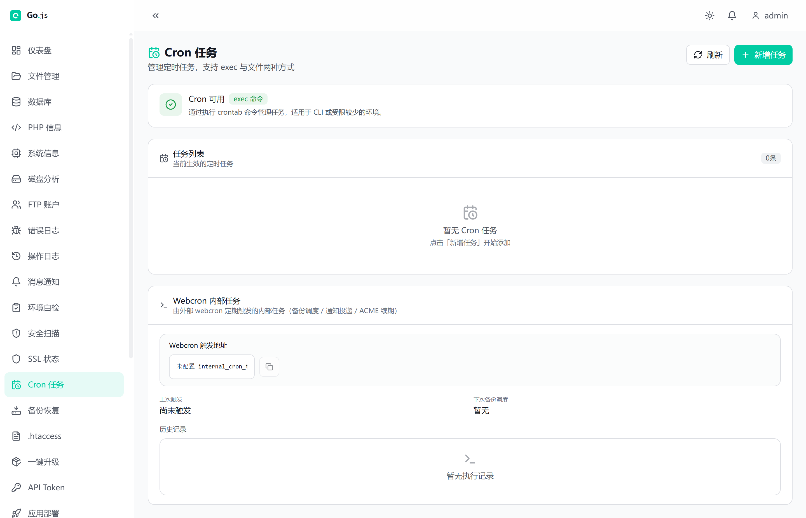

# Scheduled Tasks

## Overview

Go.js-Lite runs recurring work through three cooperating layers. The panel stores its own scheduling state (backup schedules) in `config.php`. It can also write arbitrary commands into the operating system crontab when one is available. Finally, an internal scheduler is driven over HTTP by the shipped `webcron.php` endpoint using a shared secret. On shared hosting, where shell access and `crontab` are usually unavailable, the HTTP-driven internal scheduler is the supported way to keep backups and notifications running.

## Three scheduling layers

### Panel scheduling state

Backup schedules live in `config.php` under `backup_schedules`. Each schedule has a `cron_expr`, an `enabled` flag, and a computed `next_run_at` timestamp. The internal scheduler (below) reads this list on every tick and runs any schedule whose `next_run_at` has passed. These schedules are managed from the Backup page (Schedules tab) through the `backup/schedules` endpoints; see the API reference for details.

### System crontab integration

The Cron page lets an operator manage plain cron jobs (a 5-field expression plus an arbitrary command) in the system crontab. The relevant endpoints are:

| Endpoint | Purpose |
| --- | --- |
| `cron/capabilities` | Report whether `exec` and `crontab` are usable, and which method applies |
| `cron/list` | Return the jobs currently in the crontab |
| `cron/save` | Write the full job list back to the crontab |
| `system/cron` | Read the raw system crontab (`crontab -l`) |

`cron/capabilities` returns `exec_available`, `crontab_available`, `method` (`exec`, `file` or `none`) and, for the file method, `cron_file`. With the `exec` method the panel runs `crontab` directly; with the `file` method it reads and writes a fixed crontab file. Full endpoint contracts are in the API reference under [Cron / Scheduled Tasks](api.md#cron--scheduled-tasks).

When the `file` method is selected the panel probes a short list of well-known locations (`$HOME/.config/cron/crontab`, `$HOME/.crontab`, `/var/spool/cron/<user>` and `/var/spool/cron/crontabs/<user>`) and picks the first one that is writable. With this method the operating system cron daemon must reload the crontab file after a save for the change to take effect.

### Internal scheduler and WebCron

The internal scheduler is a set of endpoints that, when triggered, execute due backup schedules and flush queued notifications. It is driven by the standalone `webcron.php` script at the panel root, or directly through the API:

| Endpoint | Purpose |
| --- | --- |
| `internal/cron` | Trigger a tick (alias of `internal/cron/tick`) |
| `internal/cron/tick` | Run due schedules and drain the outbox |
| `internal/cron/drain-outbox` | Only flush the notification outbox |
| `internal/cron/regenerate-token` | Issue a new shared token |
| `webcron/status` | Report token state, last tick and next run |

See [Internal Cron / WebCron](api.md#internal-cron--webcron) in the API reference.

Both `webcron.php` and the `internal/cron/tick` route invoke the same `gojs_internal_cron_tick` function in `backend/cron.php`, so they behave identically apart from authentication. The `webcron.php` form authenticates with the token in the URL; the API route authenticates with the token header or an admin session.

## Running recurring work without shell access

On shared hosting you normally have no SSH and no `crontab`. In that case you register the panel's `webcron.php` URL with an external uptime or webcron service (for example a free cron-ping provider) set to call it every 1 or 5 minutes. Each call runs a tick. Because the trigger is an ordinary HTTPS GET, it works even when `exec` is disabled.

Choose the ping interval to match your shortest schedule. A 5-minute ping keeps a daily or hourly backup within a few minutes of its target; if you need tighter accuracy, ping every 1 minute. A missed ping only delays the next tick, it does not drop a schedule - the tick recomputes `next_run_at` from the current time whenever it runs.

### The WebCron trigger URL

`webcron.php` sits at the panel document root, next to `api.php`. The request router strips any deployment prefix (for example `/gojs/`), so the file is reached at the site root regardless of where the panel is installed. It requires the shared token as the `token` query parameter:

Note that the query key is `token`, not `internal_cron_token`; only the API route accepts the longer name.

```
https://<panel-host>/<deploy-prefix>/webcron.php?token=<internal_cron_token>
```

A successful call returns `{ "ok": true, "stats": { ... } }`. If the token is missing or wrong the endpoint answers `403` with `code: forbidden`.

If you prefer to call the API route instead, POST to `/api/internal/cron/tick` and pass the token either as the `X-Internal-Cron-Token` request header or as the `internal_cron_token` body or query parameter. An authenticated admin session is also accepted.

### Token handling and rotation

The token is stored in `config.php` as `internal_cron_token`. It is a 32-character alphanumeric string generated by `internal/cron/regenerate-token`, and it is shown masked on the Cron page (Webcron Trigger URL) and on the Backup page (Schedules tab, Webcron Trigger URL). To generate a new token, POST to `internal/cron/regenerate-token`; the response returns the new `token`, which you must then copy into your webcron provider. Rotating the token invalidates every previously configured URL.

## What a tick does

On each tick (`gojs_internal_cron_tick` in `backend/cron.php`) the panel:

1. Loads `backup_schedules` from config.
2. For every enabled schedule whose `next_run_at` is at or before now, runs `gojs_backup_execute_schedule` (creates the archive, pushes to destinations, applies retention), records `last_run_at`, recomputes `next_run_at`, and increments `processed_schedules`.
3. Loads the backup run records and reports `processed_runs` (the current run count).
4. Drains the notification outbox by calling `gojs_channels_deliver_all`, reporting `drained_outbox`.
5. Runs the optional ACME renewal hook when present.
6. Appends a record to `webcron_history.json` (capped at `webcron_history_cap`, default 100) with `tick_at`, `status` and the stats.

The tick returns `processed_schedules`, `processed_runs`, `drained_outbox` and `tick_at`.

If you only need to flush queued notifications (for example after fixing a broken mail or webhook channel) without running backups, call `internal/cron/drain-outbox` directly. It performs step 4 only and is otherwise subject to the same token or admin-session authentication as the tick.

## Graceful degradation

The crontab layer and the internal scheduler degrade independently:

- `exec` disabled, no writable crontab file: `cron/capabilities` reports `available: false`. The Cron page shows "Cron management unavailable" and the job editor is disabled. The internal scheduler and WebCron are unaffected.
- `exec` available but `crontab` CLI missing: `cron/capabilities` reports `crontab_available: false` with `method: none`. The Cron page shows "Crontab command not found", but WebCron jobs keep running because they are triggered over HTTP, not through `crontab`.
- `exec` available and `crontab` present: `method` is `exec` (or `file` when only a crontab file is writable). The Cron page is fully usable.

In all cases backup schedules and notification delivery keep working as long as `webcron.php` is being pinged.

## Verifying it works

Open the Cron page and look at the Webcron section:

- `webcron/status` (GET) returns `token_set`, `webcron_url`, `last_triggered_at`, `next_backup_run_at`, `cap` and the last 20 `history` entries. The page renders "Last triggered", "Next backup run" and a "History" list with Success or Failed badges. When `token_set` is false the page shows "internal_cron_token not configured" and no trigger URL is displayed.
- A recent entry in History with status Success means ticks are landing.
- In the operation log, schedule activity appears as `backup_schedule_create`, `backup_schedule_update`, `backup_schedule_delete` and, for each local archive, `backup_schedule_create_local`. Backup run outcomes also surface as backup-category notifications.

If History is empty and "Not triggered yet" is shown, the URL is not being called.

## Troubleshooting

| Symptom | Likely cause | Check |
| --- | --- | --- |
| Cron page shows "Cron management unavailable" | `exec` disabled and no writable crontab file | Call `cron/capabilities`; confirm `available` is false, then rely on WebCron |
| WebCron URL returns 403 forbidden | Wrong or missing token | Compare the `token` parameter with `internal_cron_token` in `webcron/status` / config |
| History empty, "Not triggered yet" | Webcron provider not pinging the URL | Confirm the provider job is enabled and the full `webcron.php?token=...` URL is used |
| Backups never run though ticks land | All schedules disabled or `next_run_at` in the future | Check `backup/schedules`; verify schedule `enabled` and the Next backup run time |
| "Crontab command not found" but backups work | `crontab` CLI missing, WebCron still active | Expected on restricted hosts; no action needed for backup schedules |
| Old provider still running after rotation | Token regenerated but old URL in use | Replace the URL at the provider with the new `webcron.php?token=...` |

## Screenshots

Captured from a local installation of this revision, on a host where `exec()`
is available and no `internal_cron_token` has been set yet. The captures show
the panel in its Chinese localization; the English build lays the page out
identically.

### The Cron page



Left to right, top to bottom:

- **The capability banner.** Here it reads `Cron available` with the `exec`
  method badge and the reason "manages jobs by invoking the crontab command,
  suitable for CLI or less restricted environments". This is the line that
  tells you which of the three layers on this host is actually usable. On a
  host without `exec()` the same banner reports management as unavailable
  instead.
- **The job list (empty).** `No cron jobs. Click "New task" to start adding
  one.` The counter next to the section title reads `0`. These are the system
  crontab entries, and they only exist when the `exec` layer is usable.
- **The Webcron internal tasks card.** This is the layer that still works
  without shell access, described under [Internal scheduler and
  WebCron](#internal-scheduler-and-webcron) above:
  - **Webcron trigger URL** — the field shows `internal_cron_t...` unset, which
    is the state before a token exists. Set `internal_cron_token` and this
    becomes the full `webcron.php?token=...` URL to hand to the provider, with
    a copy button. It is masked here because no token has been issued.
  - **Last triggered** — `Not triggered yet`, and **Next backup run** — `None`.
    Both stay empty until the URL is called at least once and a backup schedule
    exists.
  - **History** — the execution log; empty until the first tick.

### Screens not captured here

Worth adding once an instance has been driven for a while:

- **Cron page, job list populated** — one system cron job expanded in the edit
  modal, showing the Cron Expression and command fields.
- **Cron page, Webcron section with a token set** — the full trigger URL beside
  the copy button, plus a History entry expanded to show the Success result.
- **Backup page, Schedules tab** — the schedule list with one schedule, its
  Webcron trigger URL, and the Regenerate token action.
